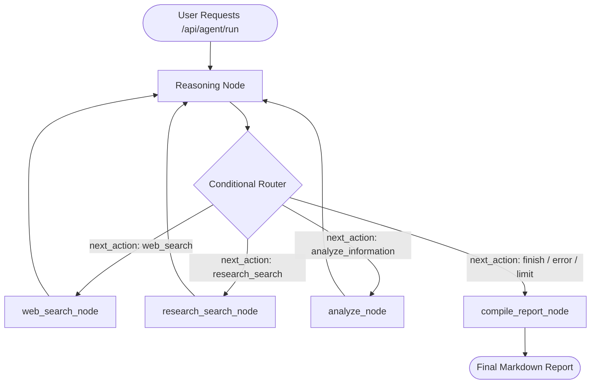

# System Architecture - Competitive Intelligence Agent

This document explains the software architecture and ReAct execution flow of the autonomous Competitive Intelligence Agent.

---

## 1. System Topology

The backend MVP is divided into three key layers:
1. **API Layer (FastAPI)**: Manages network boundaries, parses client queries, and feeds objectives into the graph runtime.
2. **State Graph Layer (LangGraph & LangChain)**: Implements the ReAct-style agentic workflow, driving routing logic and execution nodes.
3. **Execution Layer (Tools)**: Independent service wrappers containing discrete integrations with search APIs (Tavily), research repositories (arXiv), and the AI analysis engine (Gemini).

---

## 2. ReAct Agent State Machine

The core loop is modeled as a State Machine using `langgraph`. The state is shared across all nodes and updated incrementally.

### State Nodes:
* **`reasoning`**: Evaluates historical steps and gathered information. Calls Gemini with an enforced JSON schema output to determine the next logical action.
* **`web_search_node`**: Fetches fresh general search data using the Tavily client.
* **`research_search_node`**: Fetches papers from arXiv.
* **`analyze_node`**: Passes the cumulative corpus of collected snippets to the structured analyst agent for mapping out strengths, threats, key developments, and trends.
* **`compile_report_node`**: Forms a comprehensive markdown intelligence report summarizing all evidence and insights.

---

## 3. Data Schema & State Management

Defined in [state.py](file:///c:/Users/gaikw/OneDrive/Desktop/ai-agentx-intelligence/backend/state.py), the `AgentState` contains the following:
* `objective` (str): Objective input.
* `collected_evidence` (List[Dict[str, Any]]): Collected metadata and text snippets.
* `analysis_result` (Optional[Dict[str, Any]]): Result from the structured analyst node.
* `steps` (List[Dict[str, Any]]): Log containing user-safe trace events.
* `iterations` (int): Number of ReAct loop runs.
* `next_action` (Optional[str]) and `next_action_input` (Optional[str]): Used by the router to trigger the next execution block.
* `final_report` (Optional[str]): Markdown report text.
* `error` (Optional[str]): Diagnostic message.

---

## 4. Execution Step Tracing (User-Safe Logs)

To protect underlying system instructions and intermediate raw LLM thought sequences (Chain of Thought), the agent exposes a safe, curated list of **Trace Steps** via `state["steps"]`:

| Trace Type | Purpose | Example |
|---|---|---|
| `REASONING_STATUS` | Describes what the agent is doing next at a high level. | *"Searching arXiv for academic papers on multi-agent frameworks."* |
| `ACTION` | Indicates a specific tool invocation. | *`web_search(query='generative agent architectures')`* |
| `TOOL_RESULT` | Reports the tool outcome or counts. | *"Retrieved 5 search results from web search."* |
| `DECISION` | Exposes the action router's selection. | *"Decided to take action: analyze_information"* |
| `TASK_COMPLETE` | Signifies loop completion. | *"Final report generated."* |

---

## 5. Robust Error Handlers

The system is designed with multiple layers of error isolation:

* **API Handlers**: Every API wrapper (arXiv, Tavily, Gemini) is wrapped in try-except blocks. If a network failure occurs, the tool reports a diagnostic string rather than crashing the system.
* **Search Recovery (Empty Results)**: If a search query yields no results, the node adds a specific indicator `TOOL_RESULT` event ("0 results found") to the history. The reasoning node reads this history and generates a revised query rather than looping infinitely on the same term.
* **Iteration Limits**: The router checks the loop counter before returning. If `iterations > max_iterations` (default: 8), the agent routes immediately to `compile_report_node` to construct the final report using whatever data is already available.
* **Reasoning Fault-Tolerance**: If the Gemini reasoning call fails (due to rate limits, schema mismatches, etc.), the exception is caught, logged to `state["error"]`, and the router defaults to the `finish` route to cleanly return the current state rather than failing silently.
