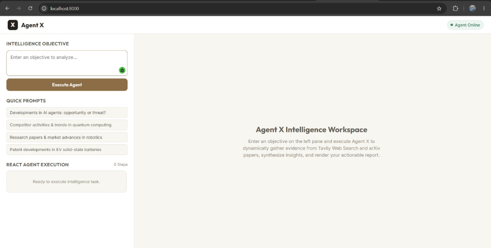
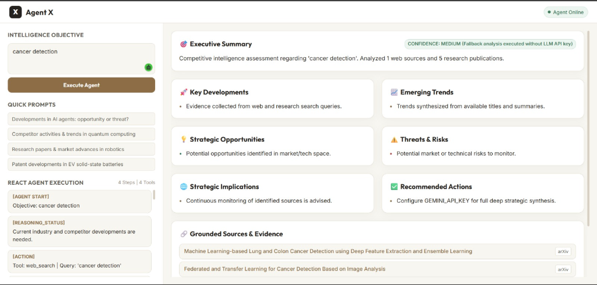
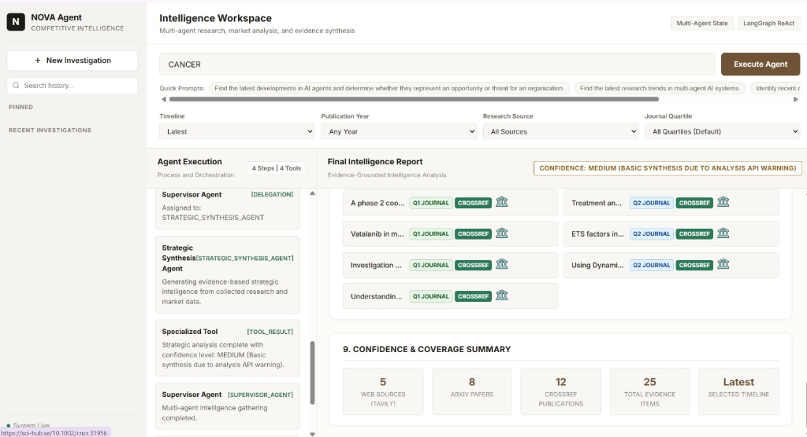
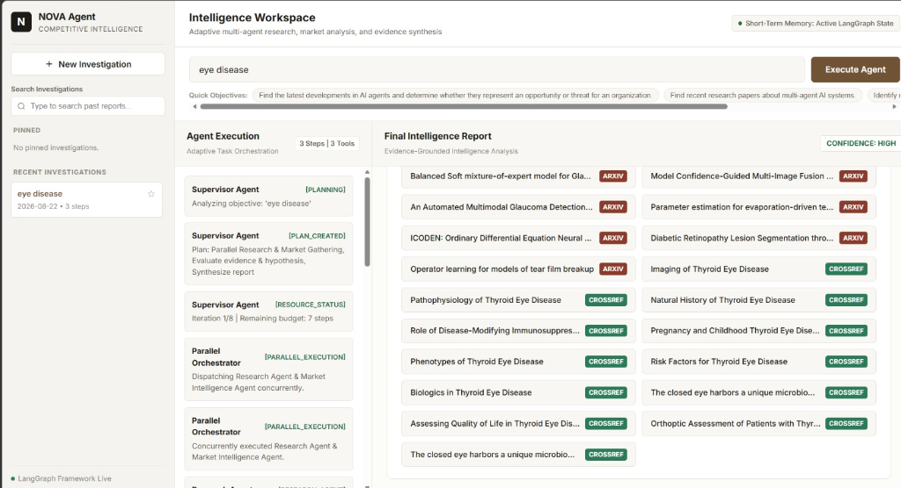
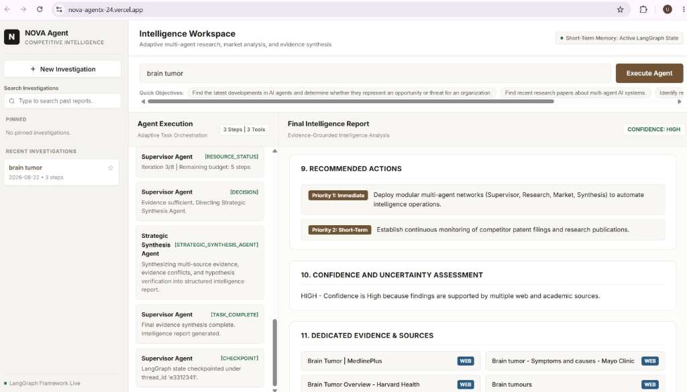
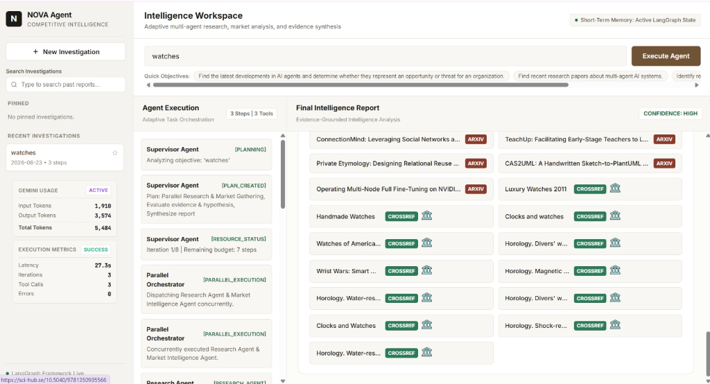
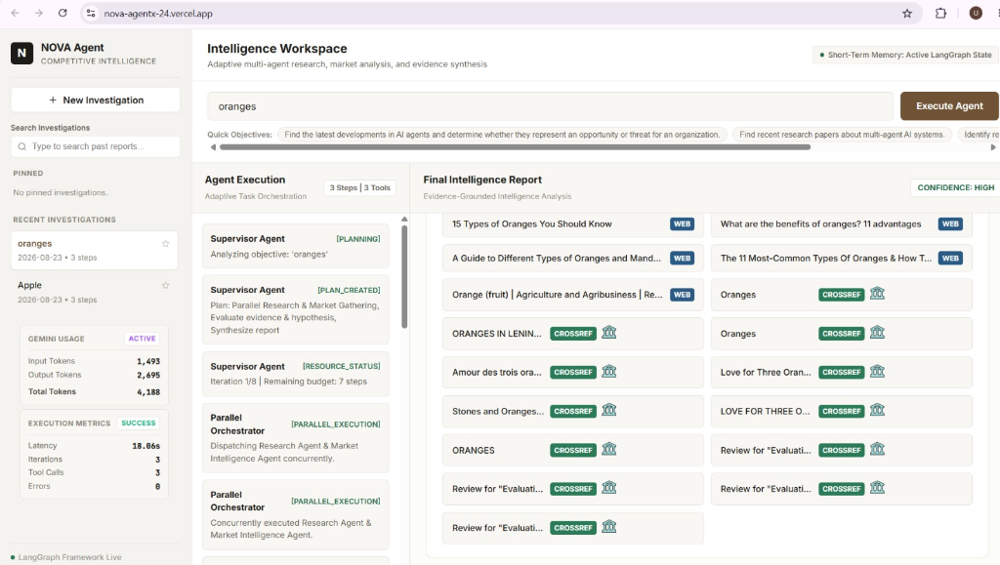

# NOVA Agent — Autonomous Competitive Intelligence System

[](https://nova-agentx-24.vercel.app)
[](https://www.python.org/)
[](https://github.com/langchain-ai/langgraph)
[](https://fastapi.tiangolo.com/)

---

## 📁 Repository Folder Structure

```text
NOVA_AGENTX24/
├── Dataset/                     # Datasets & Benchmarks (1, 2, 3)
│   ├── sample_investigations.json
│   └── README.md
├── Model/                       # Multi-Agent Models
│   ├── Model_1_Supervisor/      # Supervisor Dynamic Planning Model (supervisor.py)
│   ├── Model_2_Evaluator/       # Evaluator Hypothesis & Conflict Model (evaluator.py)
│   ├── Model_3_Synthesis/       # Strategic Synthesis Model (synthesis_agent.py)
│   └── README.md
├── Documents/                   # Presentation & Generated Reports
│   ├── PPT/                     # Presentation Slide Outlines
│   ├── screenshots/             # System UI Screenshots
│   └── Document_Generated_Report.md
├── App/                         # Main Application Directory (.py, backend, frontend, api)
│   ├── backend/                 # FastAPI, LangGraph agents, main.py, agent.py
│   ├── frontend/                # Single-Page Web Dashboard (index.html, styles.css, app.js)
│   ├── api/                     # Vercel Serverless Function entry point (index.py)
│   └── app.py                   # Standalone Python Application Launcher
├── backend/
│   └── evaluation/              # Isolated System Evaluation Module & Reports
├── vercel.json                  # Vercel deployment configuration
├── requirements.txt             # Project dependencies
├── LICENSE                      # License
└── README.md                    # Master Documentation File
```

---

## 👥 Team Members

- **Utkarsha Bhadakwade**
- **Pranav Gaikwad**
- **Vedika Pangavhane**
- **Shriraj Kamble**
- **Prathamesh Kolhe**

---

## 🎯 Problem Statement

Organizations, startups, and research institutions operate in rapidly changing competitive markets where keeping track of scientific publications, patent filings, competitor product announcements, and market developments is critical. However, manually gathering, verifying, and synthesizing data across fragmented web search engines, academic journals, and news portals is time-consuming, inefficient, and prone to missing crucial intelligence.

**NOVA Agent** solves this by orchestrating an **Autonomous Multi-Agent System** that continuously monitors research and market activities, reconciles conflicting claims, verifies analytical hypotheses, and delivers structured, evidence-grounded competitive intelligence reports in real time.

---

## 🧠 Agentic Reasoning, Tool Calling & Evaluation Architecture

### Mandatory Capabilities

#### 1. Agentic Reasoning
> Implement a reasoning pattern such as **ReAct** or an equivalent approach. The agent should reason, decide the next action, use tools, observe results, and continue until the task is completed.

NOVA Agent implements a stateful **ReAct (Reasoning + Action)** loop in LangGraph:
- **Reason**: Inspects internal state and determines what information is required.
- **Act**: Dynamically chooses tools (`web_search`, `research_search`, `crossref_search`, `analyze_information`).
- **Observe**: Collects tool outputs, updates shared state via list reducers, and continues until evidence is sufficient or safety limits are reached.

#### 2. Tool Calling
> Integrate at least **2 external tools/APIs** relevant to the problem. The agent should dynamically determine when and which tool to use.

NOVA Agent integrates 3 specialized external tools/APIs:
- **Tavily Web Search API**: Live web market news, product launches, and competitor activities.
- **arXiv REST XML API**: Scientific research papers, technical preprints, and open-access literature.
- **CrossRef REST API**: Peer-reviewed journal publications, DOIs, and citation metadata.

#### 3. Evaluation
> Define measurable criteria for accuracy, task completion, reliability, robustness, evidence quality, and efficiency using automated and human evaluation. Test the agent across normal, ambiguous, adversarial, contradictory, incomplete, and tool-failure scenarios, including repeated runs and baseline comparison. Measure accuracy, groundedness, hallucination, recovery, consistency, latency, and resource efficiency, while evaluating whether the agent can identify uncertainty, refuse unsupported conclusions, and recover from failures.

NOVA Agent includes an isolated evaluation framework (`backend/evaluation/`) testing 8 benchmark scenarios (`NORMAL`, `AMBIGUOUS`, `ADVERSARIAL`, `CONTRADICTORY`, `INCOMPLETE_EVIDENCE`, `TOOL_FAILURE`, `REPEATED_RUNS`, `BASELINE_COMPARISON`). It measures task completion, latency, iterations, tool calls, groundedness ratios, failure recovery, uncertainty qualifications, statistical consistency across 5 repeated runs, and comparative performance against a single-call LLM baseline.

#### 4. Advanced Tracing & Observability
> Implement end-to-end tracing of agents, prompts, decisions, tool calls, latency, token usage, and errors. Introduce a controlled failure and use the trace to *identify the root cause, automatically diagnose it, and improve the system*. Demonstrate measurable before-vs-after improvements in execution time, tool calls, errors, or task success rate.
> 
> *LangSmith, Langfuse, OpenTelemetry, or equivalent may be used.*

NOVA Agent incorporates a dedicated observability layer (`backend/observability/`) featuring a LangChain/LangGraph `CallbackHandler` that records trace IDs, execution spans, decision logs, tool latencies, structured error classifications (`API_ERROR`, `TIMEOUT`, `TOOL_FAILURE`), token usage, rule-based root cause diagnosis, and before-vs-after improvement comparisons.

#### 5. Deployment Done Successfully (Task 8)
> Production cloud deployment on Vercel Serverless Platform (`api/index.py`). Successfully deployed live at `https://nova-agentx-24.vercel.app` with environment variables (`GEMINI_API_KEY`, `TAVILY_API_KEY`), automatic route mapping, SQLite `/tmp` memory fallback, 60s serverless timeout threshold, and real-time live intelligence execution.

---

## 🏗️ Workflow & System Architecture

NOVA Agent is built on **LangGraph**, providing a stateful, cyclic, multi-agent orchestration graph equipped with shared state reducers, thread checkpointing (`MemorySaver`), parallel execution nodes, and autonomous replanning logic.

### 📐 End-to-End System Architecture Diagram

```
                              USER OBJECTIVE
                                    │
                                    ▼
                     ┌─────────────────────────────┐
                     │    LONG-TERM MEMORY SEARCH  │
                     │  (SQLite Past Investigations)│
                     └──────────────┬──────────────┘
                                    │
                                    ▼
                     ┌─────────────────────────────┐
                     │       SUPERVISOR AGENT      │◄─────────────────────────────┐
                     │ (Dynamic Planning Node)     │                              │
                     └──────────────┬──────────────┘                              │
                                    │                                             │
             ┌──────────────────────┼──────────────────────┐                      │
             │ Parallel Execution   │ Sequential           │ Fallback             │
             ▼                      ▼                      ▼                      │
  ┌────────────────────┐   ┌─────────────────┐   ┌────────────────────┐           │
  │ RESEARCH & MARKET  │   │ RESEARCH AGENT  │   │ MARKET INTEL AGENT │           │
  │ PARALLEL NODE      │   │ (arXiv/CrossRef)│   │ (Tavily Web Search)│           │
  └──────────┬─────────┘   └────────┬────────┘   └─────────┬──────────┘           │
             │                      │                      │                      │
             └──────────────────────┴──────────┬───────────┘                      │
                                               │                                  │
                                               ▼                                  │
                                   ┌──────────────────────┐                       │
                                   │   EVALUATOR AGENT    │                       │
                                   │ (Self-Eval, Conflict │                       │
                                   │  & Hypothesis Check) │                       │
                                   └───────────┬──────────┘                       │
                                               │                                  │
                                               ├──────────────────────────────────┘
                                               │ Self-Evaluation Passed
                                               ▼
                                   ┌──────────────────────┐
                                   │ STRATEGIC SYNTHESIS  │
                                   │ (Gemini 3.6 Flash)   │
                                   └───────────┬──────────┘
                                               │
                                               ▼
                                   ┌──────────────────────┐
                                   │ 11-PART INTELLIGENCE │
                                   │   DASHBOARD REPORT   │
                                   └──────────────────────┘
```

---

## 🤖 Specialized Multi-Agent Network

| Agent Name | Role | Core Responsibilities & Integrated Tools |
| :--- | :--- | :--- |
| **Supervisor Agent** | Dynamic Task Orchestrator | Analyzes objectives, retrieves long-term memory context, creates execution plans (`[PLANNING]`), dispatches parallel tasks, monitors resource budgets, and handles tool fallbacks. |
| **Research Agent** | Scientific & Technical Specialist | Queries **arXiv REST API** and **CrossRef REST API** for scientific papers, DOIs, technical developments, and publication year metadata. |
| **Market Intelligence Agent** | Competitor & Industry Specialist | Queries **Tavily Web Search API** for live web news, competitor product launches, company activities, and market developments. |
| **Evaluator Agent** | Self-Evaluation & Hypothesis Specialist | Performs self-evaluation (`[SELF_EVALUATION]`), verifies hypotheses (`[HYPOTHESIS_VERIFICATION]`), detects conflicting evidence (`[CONFLICT_DETECTED]`), and assesses operational confidence (`HIGH` / `MEDIUM` / `LOW`). |
| **Strategic Synthesis Agent** | Strategic Intelligence Analyst | Synthesizes multi-source evidence using **Google Gemini 3.6 Flash** into structured 11-part grounded intelligence reports. |

---

## ✨ Key Features

### 1. 🗂️ Persistent Investigation History & Visible Search
- **Persistent Left Sidebar**: Displays `+ New Investigation`, visible `Search Investigations` input, and `PINNED` & `RECENT INVESTIGATIONS` lists.
- **SQLite Storage**: Automatically saves completed investigations to `investigations.db` (with `/tmp/investigations.db` fallback on Vercel).
- **One-Click Recall**: Clicking past investigations reloads full reports and trace logs instantly.

### 2. 🧠 Short-Term & Long-Term Memory Visualization
- **Short-Term Memory**: LangGraph shared state (`AgentState`) maintained across active agent nodes.
- **Long-Term Memory**: SQLite database. Automatically retrieves relevant past investigation findings before execution and displays the **Long-Term Memory Indicator** in the workspace.

### 3. ⚡ Adaptive Task Decomposition & Parallel Execution
- **Dynamic Planning**: Supervisor generates adaptive plans (`[PLANNING]`, `[PLAN_CREATED]`) tailored to user objectives.
- **Parallel Dispatch**: Concurrently executes `ResearchAgent` and `MarketIntelligenceAgent` (`[PARALLEL_EXECUTION]`).
- **LangGraph Checkpointing**: Checkpoints workflow state under `thread_id` using `MemorySaver`.

### 4. 🛡️ Failure Recovery, Fallbacks & Deadlock Prevention
- **Tool Fallbacks**: If Tavily web search fails (`[TOOL_FAILURE]`), Supervisor automatically redirects (`[FALLBACK]`) to research paper tools.
- **Loop Detection**: Identifies repeated execution cycles (`[LOOP_DETECTED]`) and forces strategy recovery.
- **Resource-Aware Budgeting**: Tracks iteration limits (`[RESOURCE_STATUS]`) and prioritizes synthesis under tight constraints.

### 5. 📊 11-Part Final Intelligence Report Dashboard
Structured intelligence output containing:
1. **Executive Summary**
2. **Key Developments** (with category badges)
3. **Emerging Trends**
4. **Strategic Opportunities**
5. **Threats and Risks** (with `High Risk`, `Medium Risk`, `Low Risk` badges)
6. **Evidence Conflicts** (Reconciled market deployment claims vs academic risk research)
7. **Hypothesis Verification** (`SUPPORTED`, `PARTIALLY_SUPPORTED`, `INSUFFICIENT_EVIDENCE`)
8. **Strategic Implications**
9. **Recommended Actions** (`Priority 1: Immediate`, `Priority 2: Short-Term`, `Priority 3: Long-Term`)
10. **Confidence & Uncertainty Assessment** (`HIGH`, `MEDIUM`, `LOW`)
11. **Dedicated Evidence & Sources** (Clickable cards with `Q1 Journal`, `Q2 Journal`, `arXiv`, `CrossRef`, `Web` badges)

---

## 🖼️ Application Screenshots

### 1. ReAct Agent Workspace (Initial View)


### 2. ReAct Agent Execution & Completed Report


### 3. Dynamic Tool Calling Execution & Grounded Sources


### 4. Final Intelligence Dashboard & Grounded Sources


### 5. Adaptive Multi-Agent Workspace


### 6. System Evaluation & Live Intelligence Execution


### 7. Advanced Tracing & Observability


### 8. Live Vercel Production Deployment & Execution


---

## 🛠️ Technology Stack

- **Agent Framework**: Python 3.11+, LangGraph, LangChain Core
- **LLM Reasoning & Synthesis**: Google Gemini 3.6 Flash (`langchain-google-genai`)
- **Search & Tool APIs**:
  - **Tavily Web Search API**: Live web market news and competitor developments
  - **arXiv REST XML API**: Scientific publications and technical preprints
  - **CrossRef REST API**: Peer-reviewed journals, DOIs, and conference proceedings
- **Backend & Persistence**: FastAPI, Uvicorn, SQLite3, Pydantic v2, Python-Dotenv
- **Web Frontend**: HTML5, Vanilla CSS3, Vanilla JavaScript (Single-Page Workspace)
- **Deployment**: Vercel Serverless (`api/index.py` with 60s `maxDuration`)

---

## 🚀 Live Demo & Deployment Guide

### Live Application URL:
👉 **[https://nova-agentx-24.vercel.app](https://nova-agentx-24.vercel.app)**

### Vercel Deployment Instructions:
1. Import repository `https://github.com/UtkarshaBhadakwade/NOVA_AGENTX24` on [Vercel](https://vercel.com/new).
2. Configure Environment Variables under **Project Settings ➔ Environment Variables**:
   - `GEMINI_API_KEY` = your Google Gemini API key
   - `TAVILY_API_KEY` = your Tavily Search API key
3. Click **Deploy**!

---

## 💻 Local Setup & Execution

### 1. Clone & Navigate
```powershell
cd "c:\Users\VEDIKA\Downloads\New folder"
```

### 2. Environment Setup
```powershell
python -m venv venv
.\venv\Scripts\activate
pip install -r backend/requirements.txt
```

### 3. Configure `.env` File
Create `backend/.env`:
```env
GEMINI_API_KEY=your_gemini_api_key_here
TAVILY_API_KEY=your_tavily_api_key_here
```

### 4. Run Locally
- **Option A: Run Isolated Evaluation Suite**
  ```powershell
  .\venv\Scripts\python -m backend.evaluation.run_evaluation
  ```
- **Option B: Run Isolated Tracing & Observability Suite**
  ```powershell
  .\venv\Scripts\python -m backend.observability.run_observability_test
  ```
- **Option C: FastAPI Web Server**
  ```powershell
  .\venv\Scripts\uvicorn backend.main:app --reload --port 8000
  ```
  Visit **`http://localhost:8000`** in your web browser.
