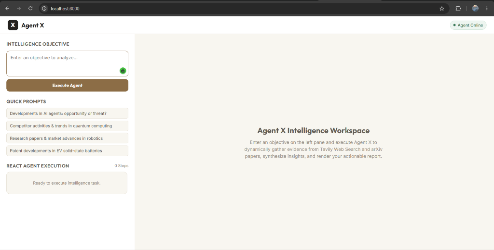
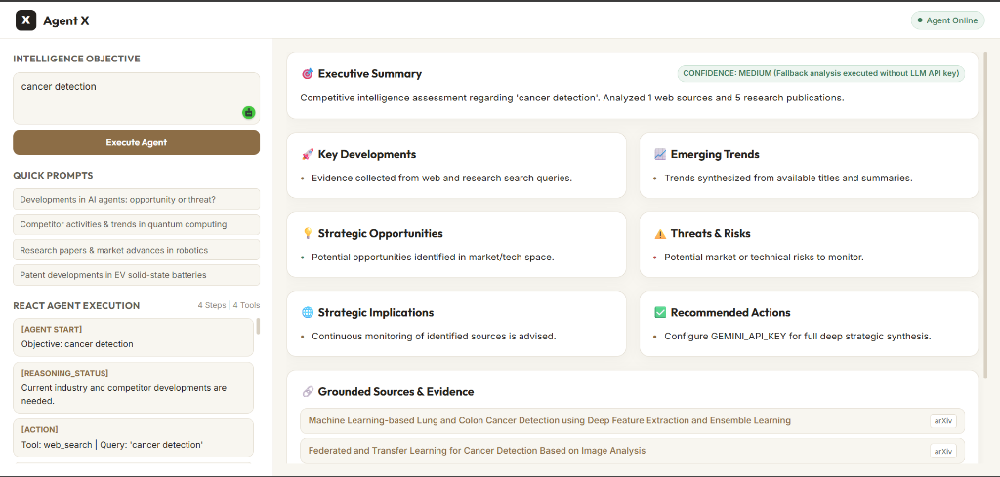

# NOVAagent — Autonomous Competitive Intelligence Agent

## Team Members
- **Utkarsha Bhadakwade**
- **Pranav Gaikwad**
- **Vedika Pangavhane**

---

## Problem Statement

Organizations, startups, and research institutions operate in highly competitive and rapidly evolving environments where staying updated on research trends, patent developments, competitor strategies, and industry news is critical. However, manually monitoring scientific publications, patent databases, news platforms, and social media sources is time-consuming, inefficient, and prone to missing important updates. The lack of timely insights can result in lost opportunities, delayed innovation, and weakened competitive positioning. Therefore, there is a need for an autonomous AI agent capable of continuously tracking research and competitor activities, analyzing vast information sources, and delivering concise, actionable insights in real time.

---

## Project Description

**NOVAagent** is an Autonomous Competitive Intelligence Agent engineered to transform raw, fragmented market and academic data into structured, actionable strategic intelligence. Built on a genuine **ReAct (Reasoning + Action) state graph architecture using LangGraph**, NOVAagent continuously evaluates intelligence objectives, identifies missing information, dynamically selects specialized search and synthesis tools, and iteratively updates its internal state.

Unlike traditional single-turn chatbots or hardcoded pipelines, NOVAagent makes real-time decisions:
1. **Evaluates Objective & State**: Determines whether real-time industry news, competitor activity, or scientific publications are required.
2. **Executes Autonomous Tools**: Gathers real live web data via Tavily API and academic research publications via arXiv API.
3. **Synthesizes Strategic Evidence**: Leverages Google Gemini 3.6 Flash to analyze collected findings without inventing unsupported facts.
4. **Generates Executive Reports**: Renders actionable competitive intelligence reports categorized into Executive Summaries, Key Developments, Emerging Trends, Strategic Opportunities, Threats & Risks, Implications, Recommended Actions, and Grounded Source References.

---

## Application Architecture & Workflow Flow

```
USER OBJECTIVE
      │
      ▼
┌─────────────┐
│ NOVAagent   │◄─────────────────────────────────────────────┐
│ (Reasoning) │                                              │
└──────┬──────┘                                              │
       │ Evaluate missing info & pick 1 action               │
       ▼                                                     │
┌─────────────┐                                              │
│ Conditional │                                              │
│ Router      │                                              │
└──────┬──────┘                                              │
       ├───────────────┬──────────────────┬──────────────────┤
       ▼               ▼                  ▼                  ▼
┌─────────────┐ ┌─────────────┐ ┌───────────────────┐ ┌──────────────┐
│ web_search  │ │research_s...│ │analyze_information│ │    finish    │
└──────┬──────┘ └──────┬──────┘ └─────────┬─────────┘ └──────┬───────┘
       │               │                  │                  │
       └───────────────┴─────────┬────────┴──────────────────┘
                                 ▼
                         Observe Results
                          & Update State
```

### Step-by-Step System Flow:
1. **User Objective Submission**: The user enters an intelligence objective via the Web Dashboard or REST API (`POST /analyze`).
2. **Agent Reasoning Node**: Evaluates the objective, current state, collected evidence, and missing information.
3. **Dynamic Action Routing**:
   - `web_search`: Uses Tavily API to gather live market news, competitor launches, and industry trends.
   - `research_search`: Queries arXiv REST API to parse scientific papers and emerging technical publications.
   - `analyze_information`: Calls Google Gemini 3.6 Flash to synthesize collected evidence into strategic insights.
   - `finish`: Concludes information gathering when evidence is sufficient or 8-iteration limit is reached.
4. **State Persistence & Loop**: LangGraph updates `AgentState` using list reducers and loops back to the Reasoning Node.
5. **Interactive Dashboard Output**: Formats and renders the structured intelligence report (Executive Summary, Key Developments, Emerging Trends, Opportunities, Threats & Risks, Strategic Implications, Recommended Actions, Confidence Level, and Grounded Sources).

---

## Technologies Used

- **Core Reasoning & Agent Graph**: Python 3.11+, LangGraph, LangChain Core
- **LLM Synthesis & Reasoning**: Google Gemini API (`gemini-3.6-flash` via `langchain-google-genai`)
- **Search & Tool APIs**:
  - **Tavily Web Search API**: Real-time competitor news, product launches, and industry trends
  - **arXiv REST XML API**: Academic papers, technical trends, and scientific publications
- **Backend Framework**: FastAPI, Uvicorn, Pydantic v2, Python-Dotenv
- **Web Frontend**: HTML5, Vanilla CSS3 (Minimal Off-White / Warm Beige Design), Vanilla JavaScript

---

## Features

- 🧠 **Genuine ReAct State Loop**: Dynamic graph loop (`START` → `REASON` → `CONDITIONAL ROUTER` → `TOOLS` → `REASON` → `FINISH`) enforcing real reasoning over hardcoded chains.
- 🛠️ **Dynamic Autonomous Tool Selection**: Dynamically routes between `web_search`, `research_search`, `analyze_information`, and `finish`.
- 📊 **Structured Intelligence Dashboard**: Categorizes insights into Executive Summary, Key Developments, Emerging Trends, Strategic Opportunities, Threats & Risks, Strategic Implications, and Recommended Actions.
- 🔗 **Grounded Sources & Citations**: Direct clickable links to live web articles and arXiv paper PDFs.
- 🛡️ **Safe Trace Event Logging**: Exposes safe, high-level trace events (`[REASONING_STATUS]`, `[ACTION]`, `[TOOL_RESULT]`, `[DECISION]`) without exposing private chain-of-thought, internal prompts, or API keys.
- ⚡ **Iteration Guardrails & Error Safety**: Enforces a safety maximum limit of 8 iterations and handles API failures gracefully.
- 🎨 **Minimalist Non-Scrollable UI**: Clean off-white and warm beige dashboard (`100vh`) with fixed viewport layout and internal pane scrolling.

---

## Installation / Setup Steps

### 1. Clone or Open Project Directory
```powershell
cd "c:\Users\VEDIKA\Downloads\New folder"
```

### 2. Create and Activate Virtual Environment
```powershell
python -m venv venv
.\venv\Scripts\activate
```

### 3. Install Dependencies
```powershell
pip install -r backend/requirements.txt
```

### 4. Configure Environment Variables
Create a `.env` file inside `backend/.env` (or root `.env`):
```env
GEMINI_API_KEY=your_gemini_api_key_here
TAVILY_API_KEY=your_tavily_api_key_here
```

---

## How to Run the Project

### Option A: Run the End-to-End Terminal Verification
To execute the ReAct agent graph test directly in your terminal:
```powershell
.\venv\Scripts\python backend/test_agent.py
```

### Option B: Start the Web Application & Server
To launch the live FastAPI web server and access the Web Dashboard:
```powershell
.\venv\Scripts\uvicorn backend.main:app --reload --port 8000
```
Open your browser and visit:
👉 **`http://localhost:8000`**

---

## Screenshots / Demo

### 1. NOVAagent Intelligence Workspace (Initial View)


### 2. Live Agent Execution & Competitive Intelligence Report Output

