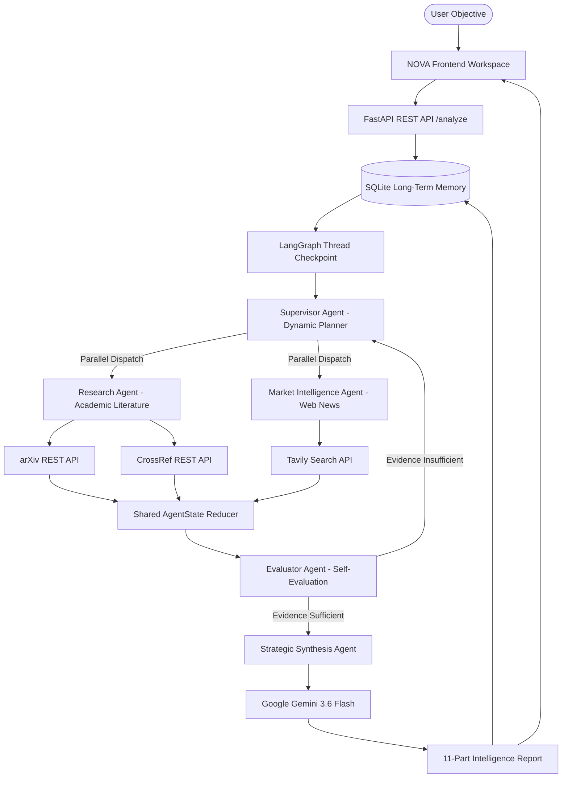

# NOVA Agent

## Autonomous Competitive Intelligence Platform

**NOVA Agent** is an enterprise-grade autonomous AI-powered Competitive Intelligence platform engineered to autonomously monitor, verify, and analyze:

- **Research Developments & Scientific Breakthroughs**
- **Peer-Reviewed Publications & Technical Preprints**
- **Industry News & Market Dynamics**
- **Competitor Announcements & Product Launches**
- **Emerging Technologies & Disruptive Innovations**
- **Market Trends & Industry Dynamics**
- **Strategic Growth Opportunities**
- **Threats, Risks, & Evidence Conflicts**

---

### 🎯 Problem Statement

Organizations, startups, and research institutions operate in rapidly changing competitive markets where keeping track of scientific publications, patent filings, competitor product announcements, and market developments is critical. However, manually gathering, verifying, and synthesizing data across fragmented web search engines, academic journals, and news portals is time-consuming, inefficient, and prone to missing crucial intelligence.

**NOVA Agent** solves this by orchestrating an **Autonomous Multi-Agent System** using **LangGraph** and **LangChain Core**. It continuously monitors research and market activities, reconciles conflicting claims, verifies analytical hypotheses, and delivers structured, evidence-grounded competitive intelligence reports in real time.

---

## 1. PROJECT OVERVIEW

### What is NOVA Agent?
NOVA Agent is a stateful multi-agent system designed for automated market intelligence gathering, literature synthesis, and strategic evidence verification. It combines dynamic planning, parallel multi-agent research dispatches, self-evaluation loops, persistent memory, end-to-end observability, and automated system diagnostics into a single unified platform.

### Why is it needed?
Standard web search engines and single-prompt LLM chatbots suffer from significant drawbacks:
1. **Lack of Evidence Grounding**: Generic chatbots often hallucinate facts, invent citations, or draw conclusions from incomplete data.
2. **Manual Fragmentation**: Analysts must manually search web news, arXiv preprints, and CrossRef DOIs separately.
3. **No Conflict Resolution**: Traditional search engines do not reconcile contradictory market claims against academic research.
4. **No Autonomous Recovery**: When an API fails or returns empty data, simple scripts crash instead of routing to alternative tools.

### What Makes NOVA Agent Different From a Normal Chatbot?
Unlike linear conversational chatbots, NOVA Agent operates an autonomous, stateful **ReAct (Reasoning + Action)** control loop. The system dynamically decomposes complex user objectives into adaptive execution plans, dispatches specialized agents concurrently, verifies evidence sufficiency, autonomously replans upon missing data, and compiles 11-part structured intelligence reports grounded exclusively in verified sources.

```
USER OBJECTIVE
      │
      ▼
PLAN GENERATION (Supervisor Agent)
      │
      ▼
TASK DECOMPOSITION & DELEGATION
      │
      ▼
PARALLEL AGENT DISPATCH (Research + Market Agents)
      │
      ▼
DYNAMIC TOOL EXECUTION (Tavily + arXiv + CrossRef)
      │
      ▼
OBSERVATION & SHARED STATE UPDATE
      │
      ▼
SELF-EVALUATION & CONFLICT RESOLUTION (Evaluator Agent)
      │
      ├───────────────────────┐
      │ (Evidence Insufficient)│ (Evidence Sufficient)
      ▼                       ▼
AUTONOMOUS REPLANNING    STRATEGIC SYNTHESIS (11-Part Intelligence Report)
```

---

## 2. REPOSITORY STRUCTURE

Below is the directory structure mapping the project repository:

```
NOVA_AGENTX24/
│
├── App/                             # Complete Application Bundle
│   ├── app.py                       # Standalone Python application launcher
│   ├── backend/                     # Backend Python package mirror
│   ├── frontend/                    # Web interface static files mirror
│   ├── api/                         # Vercel serverless entry point
│   └── vercel.json                  # Serverless function configuration
│
├── Dataset/                         # Benchmark & Validation Datasets
│   ├── sample_investigations.json   # Sample investigation benchmark dataset
│   └── README.md                    # Dataset documentation
│
├── Model/                           # Multi-Agent Architectural Models
│   ├── Model_1_Supervisor/          # Supervisor agent planning model specifications
│   ├── Model_2_Evaluator/           # Evaluator & hypothesis verification model specifications
│   ├── Model_3_Synthesis/           # Strategic synthesis model specifications
│   └── README.md                    # Multi-agent model documentation
│
├── Documents/                       # Documentation & Project Presentations
│   ├── Document_Generated_Report.md # Generated system documentation report
│   ├── TASK7_OBSERVABILITY.md       # Task 7 Tracing & Observability architecture guide
│   ├── PPT/                         # Presentation slide outlines and overviews
│   └── screenshots/                 # High-resolution system screenshots
│
├── backend/                         # Core Production Backend Architecture
│   ├── agent.py                     # Compiled LangGraph orchestration graph & checkpointer
│   ├── main.py                      # FastAPI REST API endpoints & server setup
│   ├── state.py                     # Shared AgentState schema & list reducers
│   ├── db.py                        # SQLite persistent long-term memory engine
│   ├── agents/                      # Specialized Agent Implementations
│   │   ├── research_agent.py        # Academic literature research agent
│   │   ├── market_agent.py          # Market intelligence web search agent
│   │   ├── evaluator_agent.py       # Self-evaluation & conflict resolution agent
│   │   └── synthesis_agent.py       # 11-Part strategic synthesis report agent
│   ├── tools/                       # External Tool & API Integrations
│   │   ├── web_search.py            # Tavily Web Search API client
│   │   ├── research_search.py       # arXiv REST XML API client
│   │   ├── crossref_search.py       # CrossRef REST API client
│   │   └── analyze.py               # Text processing & chunking utilities
│   ├── evaluation/                  # Task 6 Isolated Evaluation Framework
│   │   ├── evaluator.py             # Evaluation orchestrator
│   │   ├── test_cases.py            # 8 Benchmark test scenarios
│   │   ├── metrics.py               # Automated evaluation metrics engine
│   │   ├── baseline.py              # Single LLM baseline comparator
│   │   ├── human_evaluation.py      # Human evaluation rubric template
│   │   ├── run_evaluation.py        # CLI evaluation test runner
│   │   └── reports/                 # Saved evaluation JSON/CSV reports
│   └── observability/               # Task 7 Isolated Observability Framework
│       ├── tracer.py                # LangChain CallbackHandler & trace collector
│       ├── metrics.py               # Observability metrics calculator
│       ├── diagnostics.py           # Rule-based automatic root cause diagnostic engine
│       ├── failure_tests.py         # Controlled failure experiment runner
│       ├── improvement.py           # Automatic runtime strategy optimizer
│       ├── run_observability_test.py# CLI observability test runner
│       └── reports/                 # Saved observability JSON/CSV reports
│
├── frontend/                        # Web Frontend User Interface
│   ├── index.html                   # Single-page intelligence workspace HTML
│   ├── styles.css                   # Glassmorphic dark design system CSS
│   └── app.js                       # Asynchronous frontend state manager JS
│
├── api/                             # Serverless Entry Points
│   └── index.py                     # Vercel serverless function entry handler
│
├── docs/                            # Documentation Assets & Screenshots
│   └── screenshots/                 # Task 1-7 embedded interface screenshots
│
├── .gitignore                       # Git ignore configuration
├── LICENSE                          # MIT Open Source License
├── TASK7_OBSERVABILITY.md           # Task 7 Observability specification document
├── requirements.txt                 # Python dependencies manifest
├── vercel.json                      # Vercel serverless deployment routing config
└── README.md                        # Master Project Documentation
```

### Folder Purpose Descriptions:

- **`Dataset/`**: Contains reference investigation benchmark datasets used for offline evaluation and testing.
- **`Model/`**: Contains architectural specifications and prompt model configurations for the Supervisor, Evaluator, and Synthesis agents.
- **`Documents/`**: Contains project documentation, Task 7 observability documentation, presentation slide outlines, and exported architectural reports.
- **`App/`**: Contains the complete mirror bundle of backend modules, frontend assets, and standalone launcher script (`app.py`).
- **`backend/`**: Contains the production Python application, including FastAPI routes, LangGraph graph definitions, agents, tool clients, SQLite memory, evaluation suite, and observability module.
- **`frontend/`**: Contains the web interface (HTML, CSS, JavaScript) featuring the live execution stream, memory indicator, Gemini usage panel, and execution metrics panel.

---

## 3. SYSTEM ARCHITECTURE

NOVA Agent is built on **LangGraph**, providing a stateful, cyclic, multi-agent orchestration graph equipped with shared state reducers, thread checkpointing (`MemorySaver`), parallel execution nodes, and autonomous replanning logic.

### 📐 End-to-End System Architecture Diagram



---

## 4. MULTI-AGENT ARCHITECTURE

NOVA Agent divides complex competitive intelligence gathering across 5 specialized collaborative agents:

### 1. Supervisor Agent (`backend/agent.py`)
- **Responsibility**: Serves as the central orchestrator and dynamic planner. It analyzes the user objective, checks SQLite long-term memory for prior investigations, generates an adaptive execution plan, dispatches research tasks, monitors resource limits (max iterations = 8), and triggers replanning if data gaps are detected.

### 2. Research Agent (`backend/agents/research_agent.py`)
- **Responsibility**: Focuses on scientific and technical literature search. It translates objectives into academic queries, queries the arXiv REST XML API and CrossRef REST API, parses paper abstracts, DOIs, authors, and publication dates, and formats findings into structured research evidence.

### 3. Market Intelligence Agent (`backend/agents/market_agent.py`)
- **Responsibility**: Focuses on live web news and commercial market developments. It queries the Tavily Web Search API, extracts news articles, competitor product announcements, and press releases, and feeds real-time market data into the shared state.

### 4. Evaluator Agent (`backend/agents/evaluator_agent.py`)
- **Responsibility**: Conducts hypothesis testing, conflict resolution, and self-evaluation. It checks whether web claims conflict with academic literature, evaluates whether collected evidence is sufficient to satisfy the objective, and assigns hypothesis verification status (`SUPPORTED`, `PARTIALLY_SUPPORTED`, `NOT_SUPPORTED`, `INSUFFICIENT_EVIDENCE`).

### 5. Strategic Synthesis Agent (`backend/agents/synthesis_agent.py`)
- **Responsibility**: Compiles all verified findings, market trends, academic citations, and uncertainty assessments into a clean, 11-part structured competitive intelligence report using Google Gemini 3.6 Flash. If API quotas are exceeded, it executes a grounded non-LLM fallback synthesis engine.

---

## 5. AGENTIC REASONING AND LANGGRAPH

### ReAct Control Loop in LangGraph

NOVA Agent implements a stateful **ReAct (Reasoning + Action)** pattern:

```
USER OBJECTIVE ──► SUPERVISOR ──► TASK DECOMPOSITION ──► AGENT DELEGATION
                                                               │
┌──────────────────────────────────────────────────────────────┘
▼
TOOL EXECUTION ──► OBSERVATION ──► SHARED STATE UPDATE ──► EVALUATION
                                                               │
         ┌─────────────────────────────────────────────────────┤
         ▼                                                     ▼
(Evidence Insufficient)                                (Evidence Sufficient)
AUTONOMOUS REPLANNING                                  SYNTHESIS & REPORT
```

### Key Architectural Capabilities:

1. **Dynamic Planning**: The Supervisor breaks objectives into step-by-step plans stored in `state["plan"]`.
2. **Conditional Routing**: LangGraph conditional edges (`route_supervisor`) dynamically select whether to execute parallel research nodes, evaluate evidence, or trigger replanning.
3. **Shared State & Reducers**: The `AgentState` schema in `backend/state.py` uses `Annotated[List[Any], merge_lists]` reducers to combine findings from parallel worker agents without race conditions.
4. **Autonomous Replanning**: If the Evaluator Agent marks `evidence_sufficient = False`, the Supervisor increments `replan_count` and generates additional search queries.
5. **Loop Protection & Resource Budgets**: Limits execution to a maximum of 8 iterations (`max_iterations = 8`). If the loop limit is reached, it automatically forces strategic report synthesis with available data.
6. **Failure Recovery & Tool Fallback**: If Tavily fails or times out, the system logs the tool failure (`state["failed_tools"]`), activates fallback routing (`state["fallback_attempts"]`), and relies on arXiv and CrossRef academic search.

### Safe Trace Event Protocol:
Instead of exposing private LLM chain-of-thought or internal reasoning prompts, NOVA Agent records sanitized high-level trace tags:
- `[PLANNING]`: Supervisor creating execution plan.
- `[PLAN_CREATED]`: Generated plan steps.
- `[RESOURCE_STATUS]`: Iteration budget tracking.
- `[PARALLEL_EXECUTION]`: Concurrent Research & Market agent dispatch.
- `[SELF_EVALUATION]`: Evaluator hypothesis and evidence check.
- `[CHECKPOINT]`: State checkpointed under thread ID.
- `[TASK_COMPLETE]`: Final report generated successfully.

---

## 6. TOOLS AND APIs

| Tool / API | Category | Purpose & Usage in NOVA Agent |
| :--- | :--- | :--- |
| **Google Gemini 3.6 Flash** | LLM Reasoning & Synthesis | Synthesizes complex evidence into 11-part structured intelligence reports via `langchain_google_genai`. |
| **Tavily Web Search API** | Market Intelligence Tool | Searches live web news, competitor announcements, product releases, and market developments. |
| **arXiv REST XML API** | Academic Literature Tool | Queries open-access scientific preprints, computer science papers, and technical literature. |
| **CrossRef REST API** | Scholarly Metadata Tool | Searches peer-reviewed journal articles, DOIs, publication years, and academic citations. |
| **FastAPI** | Web Application Framework | Exposes high-performance async REST endpoints (`/analyze`, `/investigations`, `/health`). |
| **LangGraph** | Multi-Agent Orchestration | Manages stateful cyclic execution graphs, parallel dispatches, conditional routing, and checkpointing. |
| **LangChain Core** | Agent Framework | Provides unified abstractions for callback handlers, tools, messages, and model integrations. |
| **SQLite3** | Persistent Storage | Stores long-term investigation history, search indexes, report snapshots, and pinned items. |

---

## 7. MEMORY AND CONTEXT MANAGEMENT

NOVA Agent features a dual-layer memory system combining short-term state management with long-term persistent storage:

```
                      USER OBJECTIVE
                            │
            ┌───────────────┴───────────────┐
            ▼                               ▼
  SHORT-TERM MEMORY                 LONG-TERM MEMORY
(LangGraph Thread State)        (SQLite Persistent Database)
  - Active plan                    - Past investigation history
  - Parallel agent findings        - Full report JSON snapshots
  - Verification state             - Keyword search index
  - Thread Checkpointer            - Pinned investigations
```

### Short-Term Memory
- Managed natively by LangGraph's `MemorySaver` checkpointer and `AgentState`.
- Maintains active plan steps, pending tasks, findings from parallel agent dispatches, evidence conflict lists, and thread IDs across cyclic steps within an investigation.

### Long-Term Memory
- Powered by an embedded **SQLite3** database engine ([`backend/db.py`](file:///c:/Users/VEDIKA/Downloads/New%20folder/backend/db.py)).
- Automatically saves completed investigation reports, objective titles, step counts, tool call lists, and timestamps.
- **Search & Retrieval**: When a user enters a new objective, NOVA Agent performs a keyword search across past investigations. If a match is found, it automatically loads prior investigation context into `state["memory_context"]`, providing historical continuity.

---

## 8. INVESTIGATION HISTORY

The left sidebar of the NOVA Agent workspace provides full access to past investigation records:

- **Pinned Investigations**: Pin important investigations to keep them permanently at the top of the sidebar.
- **Recent Investigations**: View chronological list of recent intelligence lookups with timestamps and step counts.
- **Real-Time History Search**: Filter past reports dynamically using the search bar (`GET /investigations/search?q=...`).
- **One-Click Memory Reload**: Click any saved item to instantly reload its 11-part intelligence report and execution timeline.


---

## 9. INTELLIGENCE REPORT

When an investigation completes, NOVA Agent generates a comprehensive **11-Part Structured Competitive Intelligence Report**:

1. **EXECUTIVE SUMMARY**: High-level synthesis of key findings and strategic positioning.
2. **KEY DEVELOPMENTS**: Grid of verified news, research discoveries, and market events.
3. **EMERGING TRENDS**: Identified technology trajectories and market patterns.
4. **OPPORTUNITIES**: Strategic growth areas and market gaps.
5. **THREATS AND RISKS**: Competitive threats, market risks, and technology challenges.
6. **EVIDENCE CONFLICTS**: Reconciled discrepancies between web market claims and academic papers.
7. **HYPOTHESIS VERIFICATION**: Structured verification status (`SUPPORTED`, `PARTIALLY_SUPPORTED`, `NOT_SUPPORTED`, `INSUFFICIENT_EVIDENCE`).
8. **STRATEGIC IMPLICATIONS**: Business and operational impact analysis.
9. **RECOMMENDED ACTIONS**: Actionable steps for leadership and product teams.
10. **CONFIDENCE AND UNCERTAINTY ASSESSMENT**: Rated confidence level (`HIGH`, `MEDIUM`, `LOW`) and uncertainty qualifications.
11. **SOURCES USED**: Clickable grounded source citations linking to web news, arXiv preprints, and CrossRef DOIs.


---

## 10. OBSERVABILITY

NOVA Agent incorporates a dedicated, isolated observability layer ([`backend/observability/`](file:///c:/Users/VEDIKA/Downloads/New%20folder/backend/observability)) to track execution telemetry:

- **End-to-End Tracing (`NOVAObservabilityTracer`)**: Inherits from `BaseCallbackHandler` to record unique `Trace ID` (`trc_...`), component start/end times, tool latencies, sanitized decision logs, and error spans.
- **Gemini Token Usage Metadata**: Safely extracts exact `input_tokens`, `output_tokens`, and `total_tokens` from `AIMessage.usage_metadata` returned by Gemini. If unavailable (e.g. non-LLM fallback run), it records `"NOT_AVAILABLE"`.
- **Rule-Based Automatic Root Cause Diagnosis**: Evaluates trace events to automatically diagnose tool timeouts or API failures and output structured JSON recommendations (`root_cause`, `affected_component`, `evidence`, `severity`, `recommended_improvement`).
- **Controlled Failure Experiments**: Simulates tool timeouts in explicit test modes to test recovery without disrupting user workflows.
- **Before vs After Performance Measurement**: Compares execution time, tool call counts, error counts, and task success rates before and after runtime optimizations.

### Compact Sidebar Observability Cards:
The web interface features two compact sidebar panels matching the NOVA off-white/warm-beige theme:
- **GEMINI USAGE**: Displays Input Tokens, Output Tokens, Total Tokens, and Status (`ACTIVE` / `READY`).
- **EXECUTION METRICS**: Displays Latency (seconds), Iterations, Tool Calls, Error Count, and Status (`SUCCESS` / `RECOVERED` / `READY`).


---

## 11. EVALUATION

NOVA Agent includes an isolated system evaluation framework ([`backend/evaluation/`](file:///c:/Users/VEDIKA/Downloads/New%20folder/backend/evaluation)):

- **8 Benchmark Test Scenarios**: Evaluates system behavior across `NORMAL`, `AMBIGUOUS`, `ADVERSARIAL`, `CONTRADICTORY`, `INCOMPLETE_EVIDENCE`, `TOOL_FAILURE`, `REPEATED_RUNS`, and `BASELINE_COMPARISON`.
- **Automated Performance Metrics**: Measures task completion rate, groundedness ratio, failure recovery success rate, total latency, iteration counts, and tool calls.
- **Statistical Consistency (5 Repeated Runs)**: Evaluates latency variance and metric stability across repeated trials.
- **Baseline Comparison**: Compares NOVA Agent's multi-agent graph against a single-call LLM baseline to quantify performance gains from agentic reasoning and tool calling.
- **Human Evaluation Rubric**: Includes structured 1–5 scoring templates for human reviewer validation (`Accuracy`, `Groundedness`, `Evidence Quality`, `Strategic Usefulness`, `Uncertainty Handling`, `Overall Quality`).


---

## 12. FAILURE RECOVERY

NOVA Agent is designed for high resilience against real-world API and network failures:

1. **API Timeout Handling**: If Tavily or an academic API times out, the tool error is caught, categorized (`TIMEOUT`), and logged to the trace.
2. **Autonomous Tool Fallback**: Upon web search failure, the Supervisor Agent automatically falls back to arXiv and CrossRef academic search.
3. **Structured Non-LLM Fallback Synthesis**: If Gemini API quotas are exhausted (HTTP 429), `synthesis_agent.py` executes a deterministic, grounded fallback synthesis engine using collected evidence.
4. **Iteration Budget Caps**: Protects against infinite loops by capping execution at 8 iterations (`max_iterations = 8`).
5. **Data Availability Notes**: Reports transparently to the user when data sources are unavailable due to tool failures.

---

## 13. TECHNOLOGY STACK

| Technology | Purpose in NOVA Agent |
| :--- | :--- |
| **Python 3.11+** | Primary backend language |
| **FastAPI** | Async REST API server |
| **LangGraph** | Multi-agent cyclic graph orchestration & state management |
| **LangChain Core** | Callbacks, tools, messages, and model abstractions |
| **Google Gemini 3.6 Flash** | AI reasoning, hypothesis evaluation, and report synthesis |
| **Tavily Web Search API** | Live market news and web intelligence gathering |
| **arXiv REST XML API** | Open-access scientific research paper search |
| **CrossRef REST API** | Peer-reviewed journal metadata and DOI search |
| **HTML5 / Vanilla CSS3 / JavaScript** | Single-page intelligence workspace frontend |
| **SQLite3** | Persistent long-term memory & investigation database |
| **Vercel Serverless** | Cloud deployment platform (`api/index.py`) |

---

## 14. INSTALLATION

Follow these steps to set up and run NOVA Agent locally:

### Step 1: Clone Repository
```powershell
git clone https://github.com/UtkarshaBhadakwade/NOVA_AGENTX24.git
cd NOVA_AGENTX24
```

### Step 2: Create & Activate Virtual Environment
```powershell
python -m venv venv
.\venv\Scripts\activate
```

### Step 3: Install Dependencies
```powershell
pip install -r requirements.txt
```

### Step 4: Configure Environment Variables
Create a `.env` file in the root directory (or in `backend/.env`):
```env
GEMINI_API_KEY=your_google_gemini_api_key_here
TAVILY_API_KEY=your_tavily_search_api_key_here
```

### Step 5: Start FastAPI Server
```powershell
python -m uvicorn backend.main:app --reload --port 8000
```

### Step 6: Access Web Interface
Open your browser and navigate to:
```text
http://localhost:8000
```

---

## 15. ENVIRONMENT VARIABLES

| Variable | Required | Description |
| :--- | :--- | :--- |
| **`GEMINI_API_KEY`** | Yes | Google Gemini API key for LLM reasoning and synthesis. |
| **`TAVILY_API_KEY`** | Yes | Tavily Web Search API key for market news search. |
| **`GOOGLE_API_KEY`** | Optional | Alternate environment key for Google Gemini API. |
| **`LANGCHAIN_TRACING_V2`** | Optional | Set to `true` to enable external LangSmith tracing. |
| **`LANGCHAIN_API_KEY`** | Optional | API key for external LangSmith observability platform. |

---

## 16. HOW TO RUN

### 1. Web Application (FastAPI Server)
```powershell
python -m uvicorn backend.main:app --reload --port 8000
```

### 2. Standalone Application Launcher
```powershell
python App/app.py
```

### 3. Run Isolated Task 6 System Evaluation Suite
```powershell
python -m backend.evaluation.run_evaluation
```
*Generates evaluation reports in `backend/evaluation/reports/`.*

### 4. Run Isolated Task 7 Tracing & Observability Suite
```powershell
python -m backend.observability.run_observability_test
```
*Generates observability reports in `backend/observability/reports/`.*

---

## 👥 Team Members

- **Utkarsha Bhadakwade**
- **Pranav Gaikwad**
- **Vedika Pangavhane**
- **Shriraj Kamble**
- **Prathamesh Kolhe**

---

## 📄 License

This project is licensed under the **MIT License** - see the [`LICENSE`](file:///c:/Users/VEDIKA/Downloads/New%20folder/LICENSE) file for details.
