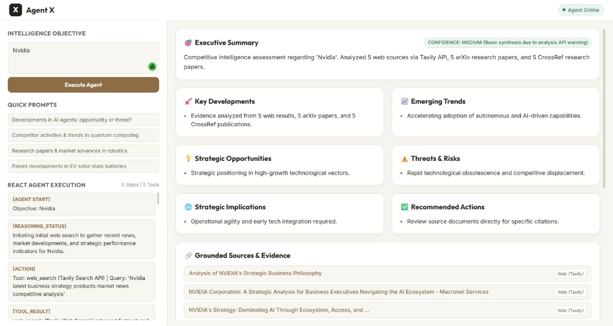

# NOVA Agent — Autonomous Competitive Intelligence System

[](https://nova-agentx-24.vercel.app)
[](https://www.python.org/)
[](https://github.com/langchain-ai/langgraph)
[](https://fastapi.tiangolo.com/)

---

## 👥 Team Members

- **Utkarsha Bhadakwade**
- **Pranav Gaikwad**
- **Vedika Pangavhane**
- **Shriraj Kamble**
- **Prathamesh Kolhe**

---

## 🎯 Problem Statement

Organizations, startups, and research institutions operate in rapidly changing competitive markets where keeping track of scientific publications, patent filings, competitor product announcements, and market developments is critical. However, manually gathering, verifying, and synthesizing data across fragmented web search engines, academic journals, and news portals is time-consuming, inefficient, and prone to missing crucial intelligence.

**NOVA Agent** solves this by orchestrating an **Autonomous Multi-Agent System** that continuously monitors research and market activities, reconciles conflicting claims, verifies analytical hypotheses, and delivers structured, evidence-grounded competitive intelligence reports in real time.

---

## 🏗️ Workflow & System Architecture

NOVA Agent is built on **LangGraph**, providing a stateful, cyclic, multi-agent orchestration graph equipped with shared state reducers, thread checkpointing (`MemorySaver`), parallel execution nodes, and autonomous replanning logic.

### 📐 End-to-End System Architecture Diagram

```
                              USER OBJECTIVE
                                    │
                                    ▼
                     ┌─────────────────────────────┐
                     │    LONG-TERM MEMORY SEARCH  │
                     │  (SQLite Past Investigations)│
                     └──────────────┬──────────────┘
                                    │
                                    ▼
                     ┌─────────────────────────────┐
                     │       SUPERVISOR AGENT      │◄─────────────────────────────┐
                     │ (Dynamic Planning Node)     │                              │
                     └──────────────┬──────────────┘                              │
                                    │                                             │
             ┌──────────────────────┼──────────────────────┐                      │
             │ Parallel Execution   │ Sequential           │ Fallback             │
             ▼                      ▼                      ▼                      │
  ┌────────────────────┐   ┌─────────────────┐   ┌────────────────────┐           │
  │ RESEARCH & MARKET  │   │ RESEARCH AGENT  │   │ MARKET INTEL AGENT │           │
  │ PARALLEL NODE      │   │ (arXiv/CrossRef)│   │ (Tavily Web Search)│           │
  └──────────┬─────────┘   └────────┬────────┘   └─────────┬──────────┘           │
             │                      │                      │                      │
             └──────────────────────┴──────────┬───────────┘                      │
                                               │                                  │
                                               ▼                                  │
                                   ┌──────────────────────┐                       │
                                   │   EVALUATOR AGENT    │                       │
                                   │ (Self-Eval, Conflict │                       │
                                   │  & Hypothesis Check) │                       │
                                   └───────────┬──────────┘                       │
                                               │                                  │
                                               ├──────────────────────────────────┘
                                               │ Self-Evaluation Passed
                                               ▼
                                   ┌──────────────────────┐
                                   │ STRATEGIC SYNTHESIS  │
                                   │ (Gemini 3.6 Flash)   │
                                   └───────────┬──────────┘
                                               │
                                               ▼
                                   ┌──────────────────────┐
                                   │ 11-PART INTELLIGENCE │
                                   │   DASHBOARD REPORT   │
                                   └──────────────────────┘
```

---

## 🤖 Specialized Multi-Agent Network

| Agent Name | Role | Core Responsibilities & Integrated Tools |
| :--- | :--- | :--- |
| **Supervisor Agent** | Dynamic Task Orchestrator | Analyzes objectives, retrieves long-term memory context, creates execution plans (`[PLANNING]`), dispatches parallel tasks, monitors resource budgets, and handles tool fallbacks. |
| **Research Agent** | Scientific & Technical Specialist | Queries **arXiv REST API** and **CrossRef REST API** for scientific papers, DOIs, technical developments, and publication year metadata. |
| **Market Intelligence Agent** | Competitor & Industry Specialist | Queries **Tavily Web Search API** for live web news, competitor product launches, company activities, and market developments. |
| **Evaluator Agent** | Self-Evaluation & Hypothesis Specialist | Performs self-evaluation (`[SELF_EVALUATION]`), verifies hypotheses (`[HYPOTHESIS_VERIFICATION]`), detects conflicting evidence (`[CONFLICT_DETECTED]`), and assesses operational confidence (`HIGH` / `MEDIUM` / `LOW`). |
| **Strategic Synthesis Agent** | Strategic Intelligence Analyst | Synthesizes multi-source evidence using **Google Gemini 3.6 Flash** into structured 11-part grounded intelligence reports. |

---

## ✨ Key Features

### 1. 🗂️ Persistent Investigation History & Visible Search
- **Persistent Left Sidebar**: Displays `+ New Investigation`, visible `Search Investigations` input, and `PINNED` & `RECENT INVESTIGATIONS` lists.
- **SQLite Storage**: Automatically saves completed investigations to `investigations.db` (with `/tmp/investigations.db` fallback on Vercel).
- **One-Click Recall**: Clicking past investigations reloads full reports and trace logs instantly.

### 2. 🧠 Short-Term & Long-Term Memory Visualization
- **Short-Term Memory**: LangGraph shared state (`AgentState`) maintained across active agent nodes.
- **Long-Term Memory**: SQLite database. Automatically retrieves relevant past investigation findings before execution and displays the **Long-Term Memory Indicator** in the workspace.

### 3. ⚡ Adaptive Task Decomposition & Parallel Execution
- **Dynamic Planning**: Supervisor generates adaptive plans (`[PLANNING]`, `[PLAN_CREATED]`) tailored to user objectives.
- **Parallel Dispatch**: Concurrently executes `ResearchAgent` and `MarketIntelligenceAgent` (`[PARALLEL_EXECUTION]`).
- **LangGraph Checkpointing**: Checkpoints workflow state under `thread_id` using `MemorySaver`.

### 4. 🛡️ Failure Recovery, Fallbacks & Deadlock Prevention
- **Tool Fallbacks**: If Tavily web search fails (`[TOOL_FAILURE]`), Supervisor automatically redirects (`[FALLBACK]`) to research paper tools.
- **Loop Detection**: Identifies repeated execution cycles (`[LOOP_DETECTED]`) and forces strategy recovery.
- **Resource-Aware Budgeting**: Tracks iteration limits (`[RESOURCE_STATUS]`) and prioritizes synthesis under tight constraints.

### 5. 📊 11-Part Final Intelligence Report Dashboard
Structured intelligence output containing:
1. **Executive Summary**
2. **Key Developments** (with category badges)
3. **Emerging Trends**
4. **Strategic Opportunities**
5. **Threats and Risks** (with `High Risk`, `Medium Risk`, `Low Risk` badges)
6. **Evidence Conflicts** (Reconciled market deployment claims vs academic risk research)
7. **Hypothesis Verification** (`SUPPORTED`, `PARTIALLY_SUPPORTED`, `INSUFFICIENT_EVIDENCE`)
8. **Strategic Implications**
9. **Recommended Actions** (`Priority 1: Immediate`, `Priority 2: Short-Term`, `Priority 3: Long-Term`)
10. **Confidence & Uncertainty Assessment** (`HIGH`, `MEDIUM`, `LOW`)
11. **Dedicated Evidence & Sources** (Clickable cards with `Q1 Journal`, `Q2 Journal`, `arXiv`, `CrossRef`, `Web` badges)

---

## 🖼️ Application Screenshots

### 1. Adaptive Multi-Agent Workspace (Task 5 Architecture)


### 2. Final Intelligence Dashboard & Grounded Sources


### 3. ReAct Execution Engine


---

## 🛠️ Technology Stack

- **Agent Framework**: Python 3.11+, LangGraph, LangChain Core
- **LLM Reasoning & Synthesis**: Google Gemini 3.6 Flash (`langchain-google-genai`)
- **Search & Tool APIs**:
  - **Tavily Web Search API**: Live web market news and competitor developments
  - **arXiv REST XML API**: Scientific publications and technical preprints
  - **CrossRef REST API**: Peer-reviewed journals, DOIs, and conference proceedings
- **Backend & Persistence**: FastAPI, Uvicorn, SQLite3, Pydantic v2, Python-Dotenv
- **Web Frontend**: HTML5, Vanilla CSS3, Vanilla JavaScript (Single-Page Workspace)
- **Deployment**: Vercel Serverless (`api/index.py` with 60s `maxDuration`)

---

## 🚀 Live Demo & Deployment Guide

### Live Application URL:
👉 **[https://nova-agentx-24.vercel.app](https://nova-agentx-24.vercel.app)**

### Vercel Deployment Instructions:
1. Import repository `https://github.com/UtkarshaBhadakwade/NOVA_AGENTX24` on [Vercel](https://vercel.com/new).
2. Configure Environment Variables under **Project Settings ➔ Environment Variables**:
   - `GEMINI_API_KEY` = your Google Gemini API key
   - `TAVILY_API_KEY` = your Tavily Search API key
3. Click **Deploy**!

---

## 💻 Local Setup & Execution

### 1. Clone & Navigate
```powershell
cd "c:\Users\VEDIKA\Downloads\New folder"
```

### 2. Environment Setup
```powershell
python -m venv venv
.\venv\Scripts\activate
pip install -r backend/requirements.txt
```

### 3. Configure `.env` File
Create `backend/.env`:
```env
GEMINI_API_KEY=your_gemini_api_key_here
TAVILY_API_KEY=your_tavily_api_key_here
```

### 4. Run Locally
- **Option A: Adversarial Test Suite**
  ```powershell
  .\venv\Scripts\python backend/test_agent.py
  ```
- **Option B: FastAPI Web Server**
  ```powershell
  .\venv\Scripts\uvicorn backend.main:app --reload --port 8000
  ```
  Visit **`http://localhost:8000`** in your web browser.

---

## 🧪 Task 5 Adversarial Verification Table

| Test Name | Status | Key Capabilities Demonstrated |
| :--- | :--- | :--- |
| **Normal Adaptive Flow** | **PASS** | `[PLANNING]`, `[PARALLEL_EXECUTION]`, `[SELF_EVALUATION]`, `[CHECKPOINT]` |
| **Tool Failure & Fallback** | **PASS** | `[TOOL_FAILURE]` ➔ `[FALLBACK]` to Research Agent |
| **Conflicting Evidence** | **PASS** | `[CONFLICT_DETECTED]` ➔ Reconciled in Report |
| **Resource Constraint** | **PASS** | `[RESOURCE_DECISION]` ➔ Budget Prioritization |
| **Self-Evaluation Failure** | **PASS** | `[SELF_EVALUATION]` ➔ Replanning Request |
